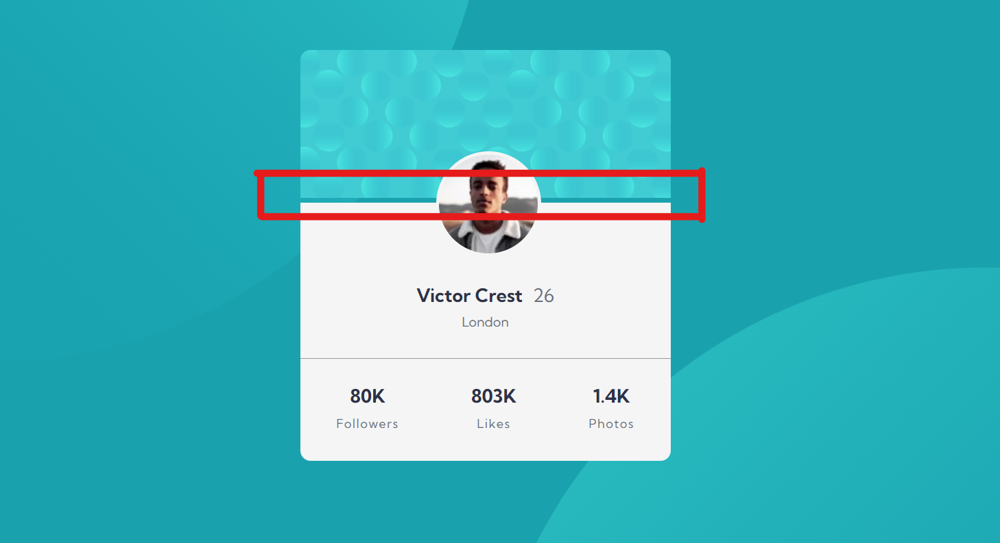

# Frontend Mentor - Profile card component solution

This is a solution to the [Profile card component challenge on Frontend Mentor](https://www.frontendmentor.io/challenges/profile-card-component-cfArpWshJ). Frontend Mentor challenges help you improve your coding skills by building realistic projects. 

## Table of contents

- [Overview](#overview)
  - [The challenge](#the-challenge)
  - [Screenshot](#screenshot)
  - [Links](#links)
- [My process](#my-process)
  - [Built with](#built-with)
  - [What I learned](#what-i-learned)
  - [Continued development](#continued-development)
  - [Useful resources](#useful-resources)
- [Author](#author)
- [Acknowledgments](#acknowledgments)

**Note: Delete this note and update the table of contents based on what sections you keep.**

## Overview

### The challenge

- Build out the project to the designs provided

### Screenshot


### Links

- Solution URL: [Frontend Mentor | Profile card component](https://esther-guo.github.io/profile-card-component-fm/)

## My process

### Built with

- Semantic HTML5 markup
- CSS custom properties
- Flexbox

### What I learned

- Use multiple background images and define their position
- border style default to `none`, set to `solid`(or other style) to make it visible
- Relatively position an element without it taking up space in document flow
```html
<div style="position: relative; width: 0; height: 0">
    <div style="position: absolute; left: 100px; top: 100px">
        Hi there, I'm 100px offset from where I ought to be, from the top and left.
    </div>
</div>
```
- Solve peoblem: Gap between border and image when border radius is added


Solution: Set `background-color` same as border color.

- Set only two corners using `border-radius` 
- Chrome has a minimum font size setting(in my case 12px), so any font size set to < 12px is still shown as 12. 
- How I get rid of weird space around an image: Add `display: block`. The line-height method also works!



[Explanation](https://stackoverflow.com/a/20788749): `img` is an inline element, so it has to deal with white-space, line-height, etc., as all inline elements. I guess the space you're seeing is actually caused by the line-height. So another solution if you want to keep your img as inline elements is to set its parent `line-height: 0;`

### Feedbacks from Frontend Mentor Community
@CyrusKabir 
- try to use more semantic elements like <main> , <section> , <footer > , etc
- your font size in category it's tooo small it's very hard to read (fixed and learned about the browser's min font size setting)
